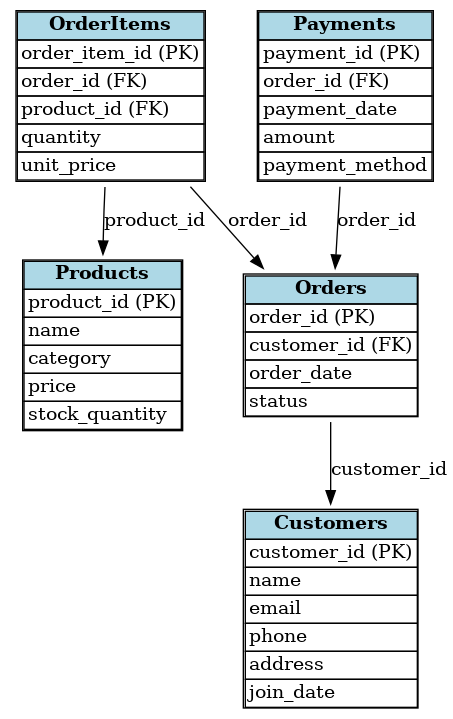
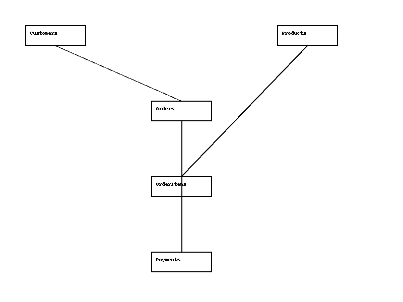

# Retail Sales & Customer Analysis

## Project Description
This project showcases an SQL-based retail sales and customer analysis system. The database includes data on customers, products, orders, order items, and payments. Several queries are written to provide insights such as total sales per month, top customers, best-selling products, and revenue by category.

## Database Schema

## Tables
- **Customers:** Contains customer information.
- **Products:** Contains product details.
- **Orders:** Contains order information.
- **OrderItems:** Contains items within each order.
- **Payments:** Contains payment details for each order.

## Sample Queries
- Total sales per month.
- Top customers by spending.
- Best-selling products.
- Revenue by category.

## How to Run
1. Run `create_tables.sql` to set up the database.
2. Run `insert_data.sql` to populate the tables with sample data.
3. Execute `analysis_queries.sql` to run different business analysis queries.
